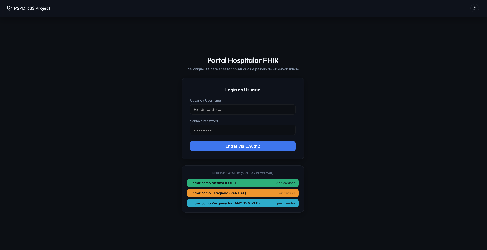
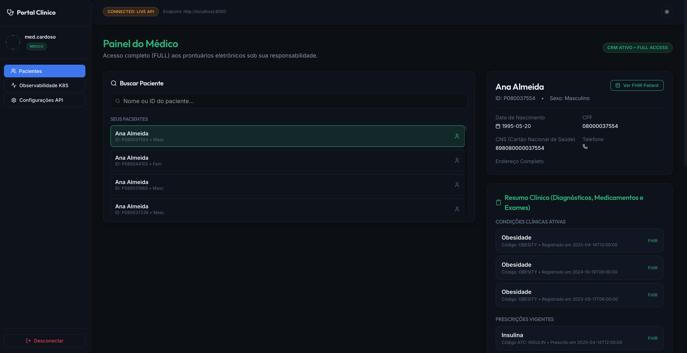
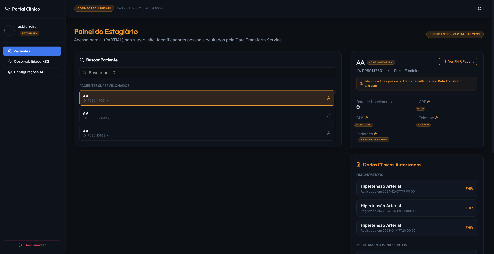
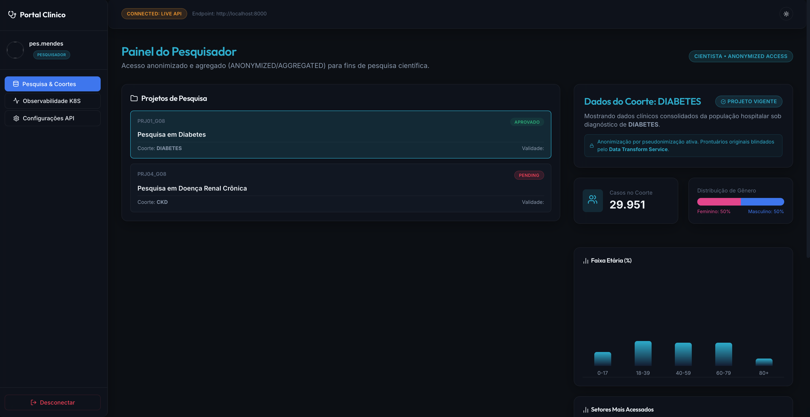

# Monitoramento e Observabilidade de Microsserviços em Clusters K8S

Este projeto acadêmico foi desenvolvido para a disciplina de **PSPD (Programação para Sistemas Paralelos e Distribuídos)** do curso de Engenharia de Software da **Universidade de Brasília (UnB - FGA)**, sob a orientação do **Prof. Fernando W. Cruz**. 

O objetivo do projeto é explorar e implementar estratégias de monitoramento, observabilidade e escalabilidade horizontal para uma aplicação baseada em microsserviços rodando em um cluster Kubernetes (K8S).

---

## 👥 Integrantes do Grupo

| Matrícula | Nome |
| :--- | :--- |
| **211062339** | Milena Baruc Rodrigues Morais |
| **212005444** | Pedro Fonseca Cruz |
| **211030980** | Daniel dos Santos Barros de Sousa |
| **180075462** | Gabriel Freitas Balbino |

---

## 🏥 Contexto da Aplicação (Portal Hospitalar HL7/FHIR)

A aplicação atende às necessidades de consulta clínica de um Hospital Universitário, cujo banco de dados relacional armazena dados de pacientes, exames, atendimentos e prescrições. Para a interoperabilidade de dados em saúde, as informações são servidas no padrão internacional **HL7/FHIR** através das seguintes estruturas (*Resources*):
* **Patient**: Dados cadastrais do paciente.
* **Encounter**: Consultas, internações e atendimentos.
* **Condition**: Diagnósticos clínicos e doenças.
* **Observation**: Resultados de exames laboratoriais e sinais clínicos.
* **MedicationRequest**: Prescrições médicas e medicamentos.

---

## 🔐 Níveis de Acesso e Controle de Permissões (RBAC)

A segurança e o nível de privacidade dos dados dependem do papel (*role*) do usuário autenticado via token JWT (gerado por um provedor OAuth2/OpenID Connect como o Keycloak):

1. **Médicos (`MEDICO`) - Acesso FULL**:
   - Visualização completa de todos os dados clínicos de pacientes sob sua responsabilidade, sem nenhuma anonimização.
2. **Estagiários (`ESTAGIARIO`) - Acesso PARTIAL**:
   - Acesso apenas a dados de pacientes vinculados ao seu médico supervisor.
   - Informações de identificação pessoal direta (como CPF, CNS, telefone, endereço) são automaticamente **anonimizadas** (removidas ou ocultadas) por meio do *Data Transform Service*.
3. **Pesquisadores (`PESQUISADOR`) - Acesso ANONYMIZED ou AGGREGATED**:
   - Acesso restrito a coortes de pesquisa (conjuntos de pacientes baseados em patologias específicas, ex: Diabetes, Pneumonia) atreladas a projetos aprovados e vigentes.
   - Apresentação de dados de exames puramente anonimizados usando identificadores alternativos (ex: `hash001`, `hash002`).
   - Visualização de estatísticas clínicas agregadas (gráficos de distribuição por idade, sexo, exames médios, frequência de medicamentos).

---

## 🏗️ Arquitetura do Sistema

A arquitetura do sistema é dividida em **Frontend** (SPA interativo com visualizador de dados FHIR e dashboards de observabilidade integrados) e **Backend**.

### Serviços Backend:
* **API Gateway**: Porta de entrada REST da API. Responsável por autenticar o JWT, aplicar rate limiting e encaminhar requisições.
* **Authorization Service**: Valida escopos de acesso, regras de negócio para as permissões (Médico x Paciente, Estagiário x Supervisor, Pesquisador x Projetos) e emite a decisão de acesso (`ALLOW` ou `DENY`).
* **Patient Data Service**: Responsável por efetuar consultas diretas ao banco de dados PostgreSQL estruturado.
* **Data Transform Service**: Executa a transformação dos registros tabulares para o padrão JSON HL7/FHIR, realizando o mascaramento de dados sensíveis (para estagiários) e as agregações de coortes (para pesquisadores).

---

## 📸 Telas da Aplicação

*(**Importante**: Substitua os links abaixo pelas imagens reais dos prints após salvá-los na pasta `docs/images` do seu repositório)*

### Tela de Login


### Painel do Médico (Acesso FULL)


### Painel do Estagiário (Acesso PARTIAL - Dados Mascarados)


### Painel do Pesquisador (Acesso AGGREGATED - Dados Anonimizados)


---

## 💻 Frontend

Para a entrega e apresentação do trabalho, o **Frontend** foi construído como um portal moderno capaz de operar em dois modos:
1. **Modo Conectado (API Gateway)**: Comunicação direta com os microsserviços integrados no K8S através de tokens JWT.
2. **Modo Demo (Mock)**: Integrado diretamente no site estático. Contém dados simulados e representação visual das métricas do Prometheus, permitindo a interação com os painéis de Médicos, Estagiários, Pesquisadores e o painel de métricas diretamente a partir do **GitHub Pages**.

### Como executar o Frontend Localmente:
1. Navegue até o diretório `frontend`:
   ```bash
   cd frontend
   ```
2. Instale as dependências necessárias:
   ```bash
   npm install
   ```
3. Inicie o servidor de desenvolvimento:
   ```bash
   npm run dev
   ```

### Credenciais para Teste (Login)

Para acessar o painel e navegar pelos diferentes perfis, utilize os seguintes usuários. A senha padrão para o modo Conectado (Live API) é `PseudoPEP2026!`. Para o modo Simulação (Mock), a senha é `123456`.

| Perfil | Modo Conectado (Usuário) | Modo Simulação (Usuário) |
| :--- | :--- | :--- |
| **Médico (FULL)** | `med.cardoso` | `medico_demo` |
| **Estagiário (PARTIAL)** | `est.ferreira` | `estagiario_demo` |
| **Pesquisador (AGGREGATED)** | `pes.mendes` | `pesq_demo` |
4. Abra o navegador no endereço indicado (ex: `http://localhost:5173`).

---

## 🚀 Pipeline de Deploy (GitHub Actions)

O deploy para o GitHub Pages ocorre de forma 100% automatizada a cada commit nas branches principais (`main` ou `master`) por meio de um fluxo de integração contínua (CI/CD) configurado em `.github/workflows/deploy.yml`.

---
*Trabalho prático da disciplina PSPD - Faculdade UnB Gama (FGA), 2026.*